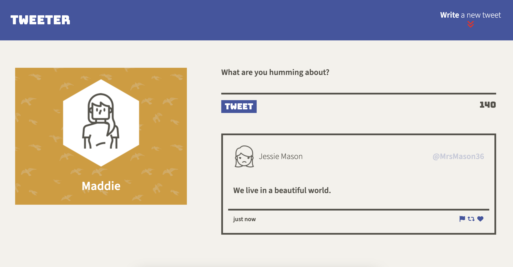
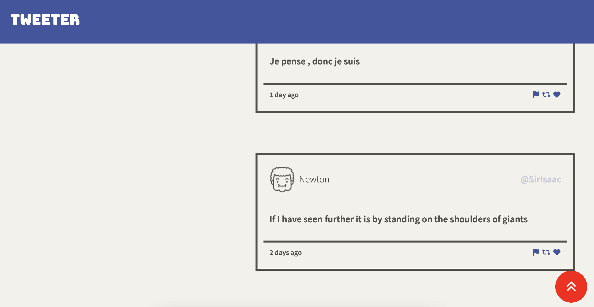
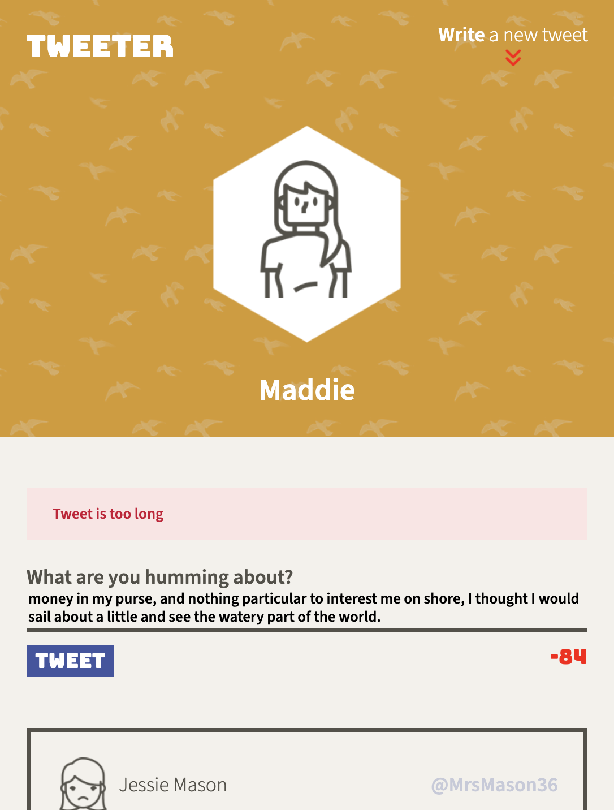

# Tweeter Project

Tweeter is a simple, single-page Twitter (RIP) clone. Write a message of 140 characters or less and post it for all to behold.

*Default appearance*

*Scroll to top button*

*Mobile viewport appearance with error message*

Built with HTML, CSS, SASS, JavaScript, jQuery and AJAX.

## Dependencies

- Express
- Node 5.10.x or above

## Getting started

1. Install all dependencies using the `npm install` command.
2. Start the web server using the `npm run local` command. The app will be served at <http://localhost:8080/>.
3. Go to <http://localhost:8080/> in your browser.
